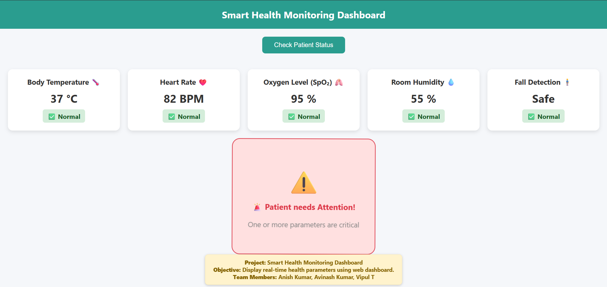

# Smart Health Monitoring Dashboard (Frontend)

## Overview
This project implements a **web-based dashboard** for monitoring key health parameters. The dashboard is designed to display real-time data from sensors (or dummy data for testing) with animated alerts and status indicators.

---
<!-- Replace with your actual image path -->

---

## Features
- Display health parameters:
  - Body Temperature 🌡️
  - Heart Rate ❤️
  - Oxygen Level (SpO₂) 🫁
  - Room Humidity 💧
  - Fall Detection 🧍‍♂️
- Visual indicators for normal or critical conditions
- Animated emojis and hints for overall patient status
- Permanent bottom note for user guidance
- Fully responsive design for different screen sizes
- **Download & Print Patient Report (PDF/Text)** option available

---

## How to Run
Click the link to open the live dashboard: [Click here](https://avinash-prajapat.github.io/Smart-Health-Monitoring-IoT-Project/)

> ⚠️ Note: Currently uses **dummy values** for testing. Real-time integration with Arduino sensors can be done by connecting a backend API using Flask or Node.js.  

---

## Notes for Real-Time Data
- The frontend is fully ready to display dynamic data from sensors.  
- JavaScript functions handle **condition checks** and **animated feedback** based on sensor values.  
- When integrating with Arduino:
  - Use serial communication to send sensor data to a backend (e.g., Flask API).  
  - The backend will serve the data via HTTP endpoints.  
  - Frontend will fetch data periodically and update the dashboard automatically.  

---

## Project Team
- **Anish Kumar**
- **Avinash Kumar**
- **Vipul Thakur**

---

## About Me 
**Avinash Kumar** – MCA-AIML student from Bihar. Interested in IoT, AI, Data Analysis, and Python-based projects."
